```ascii
╔═══════════════════════════════════════════════════════════════════════════╗
║                                                                           ║
║   ██████╗ ███████╗███████╗██████╗  █████╗ ██╗  ██╗                      ║
║   ██╔══██╗██╔════╝██╔════╝██╔══██╗██╔══██╗██║ ██╔╝                      ║
║   ██║  ██║█████╗  █████╗  ██████╔╝███████║█████╔╝                       ║
║   ██║  ██║██╔══╝  ██╔══╝  ██╔═══╝ ██╔══██║██╔═██╗                       ║
║   ██████╔╝███████╗███████╗██║     ██║  ██║██║  ██╗                      ║
║   ╚═════╝ ╚══════╝╚══════╝╚═╝     ╚═╝  ╚═╝╚═╝  ╚═╝                      ║
║                                                                           ║
║              > Microservices │ Blockchain │ Cloud ⚡️                     ║
║              > deepakpratapa2@gmail.com                                   ║
╚═══════════════════════════════════════════════════════════════════════════╝
```

<div align="center">
  
[+%7B+deploy()+%7D;const+trust+%3D+Math.proof(blockchain);await+microservice.communicate(websocket);)](https://git.io/typing-svg)


</div>

---

## `$ whoami`

```js
const deepak = {
  code: ["JavaScript", "Python", "Solidity", "Go", "TypeScript"],
  askMeAbout: ["microservices", "blockchain", "cloud", "security"],
  technologies: {
    frontEnd: {
      js: ["React", "TanStack Query"],
      css: ["Tailwind", "Styled Components"]
    },
    backEnd: {
      js: ["Node.js", "Express"],
      python: ["FastAPI", "Django"],
      blockchain: ["Solidity", "Hardhat", "Web3.py"]
    },
    databases: ["PostgreSQL", "MongoDB", "Redis", "Firestore"],
    cloud: ["AWS Lambda", "S3", "Firebase", "API Gateway"],
    devOps: ["Docker", "GitHub Actions", "CloudFormation"],
    security: ["Metasploit", "Wireshark", "Burp Suite", "Kali"]
  },
  currentFocus: "Building systems where services talk in real-time",
  funFact: "I teach students how to break systems (then fix them)"
};
```

---

## `$ git log --all --graph --pretty=format:'%h - %s'`

<table>
<tr>
<td width="50%">
<h3 align="center">🔗 PayChain</h3>
<div align="center">  
<a href="https://github.com/DeepakPratapa/paychain" target="_blank"></a>
<br><br>

```yaml
architecture: microservices
services: 
  - user-service      # JWT + MetaMask auth
  - job-service       # CRUD + workflow
  - payment-service   # Web3.py blockchain
  - websocket-server  # Real-time events
  - api-gateway       # Central routing
database:
  postgres: job data, user profiles
  redis: JWT blacklist, pub/sub
blockchain:
  network: Ganache → Polygon
  contract: PayChainEscrow.sol
  features:
    - cancelJob() before worker assigned
    - refundExpiredJob() after deadline
    - 2% platform fee calculation
realtime: WebSocket → React Query cache invalidation
```

**Try it:**
```bash
docker-compose up  # One command. Full stack.
```

</div>
</td>

<td width="50%">
<h3 align="center">⛓️ Blockchain Portfolio</h3>
<div align="center">
<a href="https://github.com/DeepakPratapa/personal-portfolio-blockchain" target="_blank"></a>
<br><br>

```solidity
// Smart contract on Polygon
contract Portfolio {
    struct Data {
        string name;
        string title;
        Experience[] experiences;
        Project[] projects;
    }
}

contract ProjectVerification {
    // SHA-256 hash of entire codebase
    bytes32 public dataHash;
    
    function verifyIntegrity() external view 
        returns (bool) {
        // Anyone can verify deployed code
        // matches source on GitHub
    }
}
```

**Verify it:**
```bash
npm run verify:codebase  # Check integrity
npm run verify:store     # Store on-chain
```

</div>
</td>
</tr>

<tr>
<td width="50%">
<h3 align="center">☁️ Serverless Image Processor</h3>
<div align="center">
<a href="https://github.com/DeepakPratapa/serverless-img-proc-aws" target="_blank"></a>
<br><br>


```yaml
infrastructure: AWS
pipeline:
  1: User uploads → S3 (raw-images/)
  2: S3 event triggers Lambda
  3: Lambda processes image
  4: Output → S3 (processed-images/)
stack:
  - AWS Lambda (Python)
  - S3 event notifications
  - API Gateway
  - CloudFormation (IaC)
  - GitHub Actions (CI/CD)
```

</div>
</td>

<td width="50%">
<h3 align="center">🔥 Firebase Task Manager</h3>
<div align="center">
<a href="https://github.com/DeepakPratapa/serverless-task-manager-firebase" target="_blank"></a>
<br><br>

```js
// Real-time magic ✨
const db = getFirestore();

// Listen for changes
onSnapshot(collection(db, "tasks"), (snapshot) => {
  snapshot.docChanges().forEach((change) => {
    if (change.type === "added") {
      updateUI(change.doc.data());
    }
  });
});

// Cloud Function auto-triggers
exports.sendReminder = functions.firestore
  .document('tasks/{taskId}')
  .onCreate(async (snap, context) => {
    // Send email notification
    await sendEmail(snap.data());
  });
```

</div>
</td>
</tr>
</table>

---

## `$ npm run stats`

<div align="center">


</div>

---

## `$ cat ~/current-stack.yml`

```yaml
expertise:
  distributed_systems:
    - 5-microservice architectures
    - WebSocket real-time communication
    - Service-to-service authentication
    - Message queues (Redis pub/sub)
  
  blockchain:
    - Smart contract development (Solidity 0.8.20)
    - Hardhat testing & deployment
    - Web3 integration (ethers.js, Web3.py)
    - Gas optimization patterns
  
  cloud_native:
    - AWS Lambda + S3 event triggers
    - Firebase real-time database
    - Infrastructure as Code (CloudFormation)
    - Serverless architectures
  
  security:
    - Penetration testing (Metasploit, Burp Suite)
    - Network monitoring (Wireshark, Suricata)
    - Cryptographic verification (SHA-256)
    - Incident response & threat intelligence

tools_in_production:
  languages: [JavaScript, TypeScript, Python, Solidity, Go]
  frameworks: [React, FastAPI, Node.js, Django]
  databases: [PostgreSQL, Redis, MongoDB, Firestore]
  devops: [Docker, GitHub Actions, Git]
  monitoring: [CloudWatch, Firebase Analytics]
```

---

## `$ ./recent-activity.sh`

```console
[2025] 🔗 Building PayChain escrow platform
       └─ 5 microservices communicating via WebSocket
       └─ MetaMask signature auth (no passwords!)
       └─ React Query + WebSocket = instant UI updates

[2024] 📚 Teaching pen-testing to 30+ students @ UCO
       └─ Labs: Metasploit, Burp Suite, network defense
       └─ Mentoring secure coding practices

[2024] 🔬 Graduate Research Assistant @ UCO
       └─ Built Django HTTPS app for research viz
       └─ OPNsense + Suricata network monitoring
       └─ IEEE 2030.5 smart grid simulation (Python)

[2022] 📝 Published research: ATM encryption (IRJET)
       └─ Python prototype: Hash + RSA
       └─ Validated MITM attack resistance
```

---

## `$ echo $WORKFLOW`

```mermaid
graph TD
    A[Idea 💡] --> B[Design Architecture]
    B --> C[Write Tests First 🧪]
    C --> D[Implement Features]
    D --> E[Security Scan 🔒]
    E --> F{Pass?}
    F -->|No| D
    F -->|Yes| G[Docker Build 🐳]
    G --> H[CI/CD Pipeline]
    H --> I[Deploy to Cloud ☁️]
    I --> J[Monitor Metrics 📊]
    J --> K{Issues?}
    K -->|Yes| D
    K -->|No| L[Ship it! 🚀]
```



---

## `$ curl -s https://api.github.com/users/DeepakPratapa | jq .bio`

<div align="center">

### 💭 Philosophy

```js
while (learning) {
  build();
  break();
  fix();
  teach();
}

// Security is architecture, not afterthought
// Documentation is code for humans
// Monitoring > Hoping
```

</div>

---

## `$ nc deepak.dev 443`

<div align="center">

[](https://github.com/DeepakPratapa)
[](https://www.linkedin.com/in/deepak-pratapa-b6316b178)
[](https://deepakpratapa.com)
[](mailto:deepakpratapa2@gmail.com)

```console
$ ssh deepak@career.dev
> Interested in: Full-Stack | Microservices | Blockchain | Cloud
> Status: Open to opportunities
> Location: Remote-friendly
```

</div>

---

<div align="center">


### 💭 "Code is law. Math is proof. Blockchain is truth."

*Building systems where trust is a mathematical guarantee, not a promise.*


**⭐️ From [DeepakPratapa](https://github.com/DeepakPratapa)**

</div>
